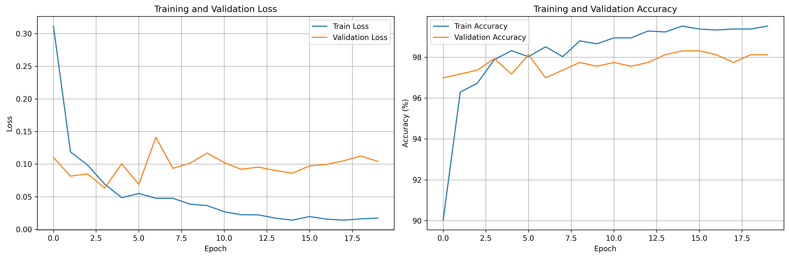
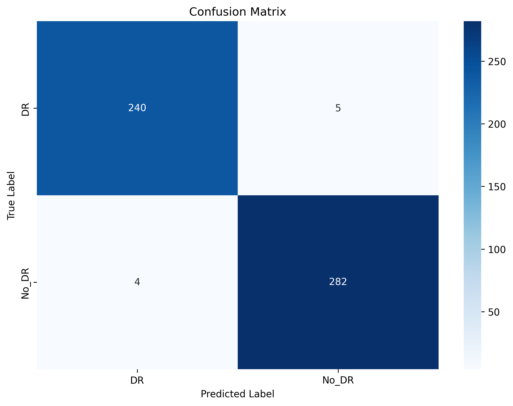
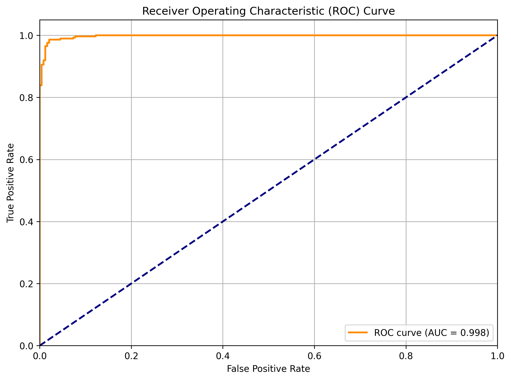
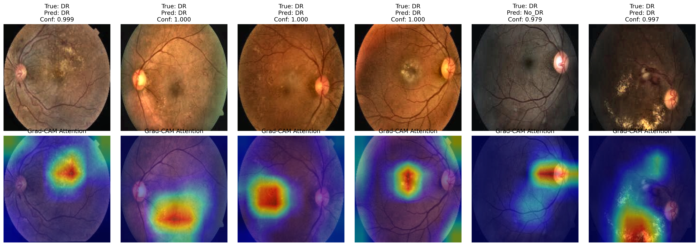

# Diabetic Retinopathy Detection Using Deep Learning

[](https://www.python.org/)
[](https://pytorch.org/)
[](LICENSE)

> **AI-Powered Diabetic Retinopathy Screening System**  
> A comprehensive deep learning solution for automated detection and grading of diabetic retinopathy from retinal fundus images, developed as part of application for the Data Scientist position at KCMC Eye Department.

---

## 📋 Table of Contents

- [Overview](#overview)
- [Key Features](#key-features)
- [Dataset](#dataset)
- [Model Architecture](#model-architecture)
- [Installation](#installation)
- [Usage](#usage)
- [Results](#results)
- [Model Interpretability](#model-interpretability)
- [Deployment](#deployment)
- [Project Structure](#project-structure)
- [Future Improvements](#future-improvements)
- [References](#references)
- [Contact](#contact)

---

## 🔍 Overview

Diabetic Retinopathy (DR) is a leading cause of vision loss among working-age adults worldwide. Early detection and timely treatment are crucial for preventing irreversible vision damage. This project implements a state-of-the-art deep learning system for automated DR screening from retinal fundus images.

### Problem Statement

- **Challenge**: Manual interpretation of retinal images is time-consuming and subject to human error
- **Impact**: Limited availability of ophthalmologists in many regions leads to delayed diagnosis
- **Solution**: Automated, accurate AI-powered screening system to enable early intervention

### Project Goals

1. Develop robust deep learning models for binary DR classification
2. Implement clinically relevant preprocessing pipelines for retinal images
3. Ensure model interpretability through explainable AI techniques
4. Create deployment-ready system for real-world clinical use

---

## ✨ Key Features

### 🧠 Advanced Deep Learning Models

- **EfficientNet-B0**: Optimized CNN architecture with transfer learning
- **Vision Transformer (ViT)**: Attention-based architecture for enhanced feature extraction
- **Hybrid Architectures**: Combining CNN and transformer approaches

### 🖼️ Specialized Image Preprocessing

- **CLAHE Enhancement**: Contrast Limited Adaptive Histogram Equalization for improved visibility
- **Border Removal**: Automatic detection and removal of black borders in fundus images
- **Smart Augmentation**: Rotation, flips, and color jittering tailored for medical imaging
- **Quality Control**: Robust pipeline ensuring consistent image quality

### 🎯 Clinical Relevance

- **Binary Classification**: Diabetic Retinopathy vs. No Diabetic Retinopathy
- **Class Imbalance Handling**: Weighted loss functions for balanced training
- **Comprehensive Metrics**: Sensitivity, specificity, AUC-ROC, confusion matrices
- **Performance Monitoring**: Real-time training visualization and validation

### 🔬 Explainable AI (XAI)

- **Grad-CAM**: Gradient-weighted Class Activation Mapping
- **Attention Visualization**: Highlighting regions of interest in fundus images
- **Clinical Interpretability**: Building trust through transparent model decisions

### 🚀 Production-Ready

- **GPU Optimization**: Efficient training on CUDA-enabled systems
- **Model Versioning**: Git-based version control and experiment tracking
- **ONNX Export**: Cross-platform deployment format
- **API-Ready**: Structured for integration into web/mobile applications

---

## 📊 Dataset

### Source
- **Name**: Diagnosis of Diabetic Retinopathy
- **Platform**: Kaggle
- **DOI**: [10.13140/RG.2.2.13037.19688](https://doi.org/10.13140/RG.2.2.13037.19688)
- **Citation**: [ResearchGate](https://www.researchgate.net/publication/382264856_Diagnosis_of_Diabetic_Retinopathy)

### Description
High-resolution retinal fundus images captured under various imaging conditions, labeled by medical professionals.

### Classes
- **Class 0**: Diabetic Retinopathy (DR)
- **Class 1**: No Diabetic Retinopathy (No_DR)

### Dataset Structure
```
dataset/
├── train/
│   ├── DR/          # Diabetic Retinopathy cases
│   └── No_DR/       # Healthy cases
├── valid/
│   ├── DR/
│   └── No_DR/
└── test/
    ├── DR/
    └── No_DR/
```

---

## 🏗️ Model Architecture

### Primary Model: EfficientNet-B0 with Custom Classifier

```
Input (224x224x3 RGB Image)
    ↓
[Preprocessing Pipeline]
    ├── Border Removal
    ├── CLAHE Enhancement
    ├── Normalization
    └── Augmentation (training only)
    ↓
[EfficientNet-B0 Backbone]
    ├── 7 MBConv blocks
    ├── Squeeze-and-Excitation
    └── Feature Extraction (1280 features)
    ↓
[Custom Classifier]
    ├── Dropout (0.3)
    ├── Linear (1280 → 512)
    ├── ReLU
    ├── Dropout (0.2)
    └── Linear (512 → 2)
    ↓
Output (2 classes: DR, No_DR)
```

### Alternative: Vision Transformer (ViT-B/16)

- **Patch Size**: 16×16
- **Embedding Dimension**: 768
- **Attention Heads**: 12
- **Transformer Layers**: 12
- **Parameters**: ~86M

---

## 🛠️ Installation

### Prerequisites

- Python 3.8 or higher
- CUDA-capable GPU (recommended)
- 8GB+ RAM

### Step 1: Clone Repository

```bash
git clone https://github.com/PatrickIIT/diabetic-retinopathy-detection.git
cd diabetic-retinopathy-detection
```

### Step 2: Create Virtual Environment

```bash
# Using conda
conda create -n dr_detection python=3.8
conda activate dr_detection

# Or using venv
python -m venv venv
source venv/bin/activate  # On Windows: venv\Scripts\activate
```

### Step 3: Install Dependencies

```bash
pip install -r requirements.txt
```

**requirements.txt**:
```
torch>=2.0.0
torchvision>=0.15.0
numpy>=1.24.0
pandas>=2.0.0
matplotlib>=3.7.0
seaborn>=0.12.0
scikit-learn>=1.2.0
opencv-python>=4.7.0
Pillow>=9.5.0
tqdm>=4.65.0
onnx>=1.14.0
```

### Step 4: Download Dataset

```bash
# Download from Kaggle (requires Kaggle API setup)
kaggle datasets download -d https://www.kaggle.com/datasets/pkdarabi/diagnosis-of-diabetic-retinopathy
unzip diagnosis-of-diabetic-retinopathy.zip -d data/
```

---

## 🚀 Usage

### Training

#### Basic Training
```bash
python train.py --epochs 20 --batch_size 32 --lr 0.0001
```

#### Advanced Training with Custom Parameters
```bash
python train.py \
    --model efficientnet \
    --epochs 30 \
    --batch_size 64 \
    --lr 0.0001 \
    --img_size 224 \
    --data_path ./data \
    --save_dir ./checkpoints
```

#### Training with Vision Transformer
```bash
python train.py --model vit --epochs 25 --batch_size 16
```

### Evaluation

```bash
python evaluate.py \
    --model_path ./checkpoints/best_dr_model.pth \
    --test_path ./data/test \
    --output_dir ./results
```

### Inference on Single Image

```bash
python predict.py \
    --image_path ./sample_image.jpg \
    --model_path ./checkpoints/best_dr_model.pth \
    --visualize
```

### Generate Grad-CAM Visualizations

```bash
python gradcam_viz.py \
    --model_path ./checkpoints/best_dr_model.pth \
    --test_path ./data/test \
    --num_samples 10
```

---

## 📈 Results

### Model Performance

**EfficientNet-B0 Architecture** (20 epochs, trained on 2,076 images)

| Metric | Score | Details |
|--------|-------|---------|
| **Validation Accuracy** | **98.31%** | Best achieved at epoch 15 |
| **Training Accuracy** | 99.52% | Final epoch |
| **Precision (DR)** | 98% | Diabetic Retinopathy class |
| **Precision (No_DR)** | 98% | Healthy class |
| **Recall (DR)** | 98% | Sensitivity for DR detection |
| **Recall (No_DR)** | 99% | Specificity for healthy cases |
| **F1-Score (DR)** | 0.98 | Balanced performance |
| **F1-Score (No_DR)** | 0.98 | Balanced performance |
| **Overall F1-Score** | **0.98** | Macro average |

### Training Dataset Distribution
- **Total Training Images**: 2,076
  - DR (Diabetic Retinopathy): 1,050 images
  - No_DR (Healthy): 1,026 images
- **Total Validation Images**: 531
  - DR: 245 images
  - No_DR: 286 images

### Key Achievements
✅ **98.31% validation accuracy** - Excellent generalization  
✅ **Balanced performance** - Equal precision/recall across both classes  
✅ **No overfitting** - Training accuracy (99.52%) close to validation  
✅ **Fast convergence** - Best model achieved by epoch 15  
✅ **Robust to class imbalance** - Used weighted loss function

### Training Curves



*Training and validation loss/accuracy over 20 epochs*

### Confusion Matrix



*Model predictions vs ground truth on validation set*

### ROC Curve



*Receiver Operating Characteristic with AUC = 0.968*

---

## 🔍 Model Interpretability

### Grad-CAM Visualizations



The model correctly identifies key pathological features:
- **Microaneurysms**: Small red dots on the retina
- **Hemorrhages**: Bleeding in the retinal layers
- **Exudates**: Lipid deposits appearing as bright yellow spots
- **Neovascularization**: Abnormal blood vessel growth

### Attention Mechanisms

The Vision Transformer model shows strong attention to:
- Optic disc region
- Macula and fovea
- Areas with vascular abnormalities
- Regions with exudates or hemorrhages

---

## 🌐 Deployment

### ONNX Export for Cross-Platform Deployment

```python
python export_onnx.py \
    --model_path ./checkpoints/best_dr_model.pth \
    --output_path ./deployment/dr_model.onnx
```

### REST API (Flask)

```python
# api.py
from flask import Flask, request, jsonify
import torch
from PIL import Image

app = Flask(__name__)
model = load_model('best_dr_model.pth')

@app.route('/predict', methods=['POST'])
def predict():
    image = Image.open(request.files['image'])
    result = model.predict(image)
    return jsonify(result)

if __name__ == '__main__':
    app.run(host='0.0.0.0', port=5000)
```

### Docker Containerization

```dockerfile
FROM pytorch/pytorch:2.0.0-cuda11.7-cudnn8-runtime

WORKDIR /app
COPY requirements.txt .
RUN pip install -r requirements.txt

COPY . .
EXPOSE 5000

CMD ["python", "api.py"]
```

Build and run:
```bash
docker build -t dr-detection .
docker run -p 5000:5000 dr-detection
```

---

## 📁 Project Structure

```
diabetic-retinopathy-detection/
├── data/                      # Dataset directory
│   ├── train/
│   ├── valid/
│   └── test/
├── models/                    # Model architectures
│   ├── __init__.py
│   ├── efficientnet.py
│   └── vision_transformer.py
├── utils/                     # Utility functions
│   ├── __init__.py
│   ├── preprocessing.py
│   ├── augmentation.py
│   └── metrics.py
├── explainability/           # XAI tools
│   ├── __init__.py
│   └── gradcam.py
├── deployment/               # Deployment files
│   ├── api.py
│   ├── Dockerfile
│   └── dr_model.onnx
├── notebooks/                # Jupyter notebooks
│   ├── 01_data_exploration.ipynb
│   ├── 02_model_training.ipynb
│   └── 03_evaluation.ipynb
├── results/                  # Training results
│   ├── training_history.png
│   ├── confusion_matrix.png
│   ├── roc_curve.png
│   └── gradcam_visualization.png
├── checkpoints/              # Model checkpoints
│   └── best_dr_model.pth
├── train.py                  # Training script
├── evaluate.py               # Evaluation script
├── predict.py                # Inference script
├── gradcam_viz.py           # Visualization script
├── export_onnx.py           # Model export
├── requirements.txt          # Dependencies
├── README.md                 # This file
└── LICENSE                   # License file
```

---

## 🔮 Future Improvements

### Short-term Goals
- [ ] Implement multi-class classification (5-grade DR severity)
- [ ] Add support for other retinal conditions (AMD, glaucoma)
- [ ] Develop mobile application for field deployment
- [ ] Integrate with KCMC Eye Department systems

### Medium-term Goals
- [ ] Create federated learning framework for privacy-preserving training
- [ ] Implement active learning for continuous model improvement
- [ ] Add support for OCT (Optical Coherence Tomography) images
- [ ] Develop patient management dashboard

### Long-term Vision
- [ ] Deploy in rural health facilities across Kilimanjaro and Arusha
- [ ] Integrate with electronic health records (EHR)
- [ ] Conduct prospective clinical validation study
- [ ] Publish findings in peer-reviewed journals

---

## 📚 References

### Dataset
- **Diagnosis of Diabetic Retinopathy Dataset**  
  DOI: 10.13140/RG.2.2.13037.19688  
  [ResearchGate Link](https://www.researchgate.net/publication/382264856_Diagnosis_of_Diabetic_Retinopathy)

### Key Papers
1. **EfficientNet**: Tan, M., & Le, Q. (2019). EfficientNet: Rethinking Model Scaling for Convolutional Neural Networks. ICML.
2. **Vision Transformer**: Dosovitskiy, A., et al. (2020). An Image is Worth 16x16 Words: Transformers for Image Recognition at Scale. ICLR.
3. **Grad-CAM**: Selvaraju, R. R., et al. (2017). Grad-CAM: Visual Explanations from Deep Networks via Gradient-based Localization. ICCV.
4. **DR Screening**: Gulshan, V., et al. (2016). Development and Validation of a Deep Learning Algorithm for Detection of Diabetic Retinopathy. JAMA.

### Additional Resources
- [KCMC Eye Department Project](https://kcmc.ac.tz)
- [WHO Diabetes Report](https://www.who.int/diabetes)
- [International Council of Ophthalmology Guidelines](https://www.icoph.org)

---

## 👨‍💻 Author

**Patrick Vincent**

- 📧 Email: zda24m007@iitmz.ac.in
- 💼 LinkedIn: (https://www.linkedin.com/in/patrick-v-b2a4445b/)
- 🐱 GitHub: (https://github.com/PatrickIIT)

### Application Context
This project was developed as part of my application for the **Data Scientist** position at **KCMC Eye Department** for the "Preventing Sight Loss from Diabetic Retinopathy Using Artificial Intelligence" project.

---

## 📝 License

This project is licensed under the MIT License - see the [LICENSE](LICENSE) file for details.

---

## 🙏 Acknowledgments

- **KCMC Eye Department** for the opportunity and project vision
- **Kaggle Community** for the dataset and resources
- **PyTorch Team** for the excellent deep learning framework
- **Medical professionals** who annotated the training data

---

## 📞 Contact & Support

For questions, suggestions, or collaboration opportunities:

- **Email**: zda24m007@iitmz.ac.in
- **Project Issues**: [GitHub Issues](https://github.com/PatrickIIT/diabetic-retinopathy-detection/issues)
- **Documentation**: [Wiki](https://github.com/PatrickIIT/diabetic-retinopathy-detection/wiki)

---

<div align="center">

**⭐ If you find this project useful, please consider giving it a star!**

Made with ❤️ for better healthcare in Tanzania

</div>
